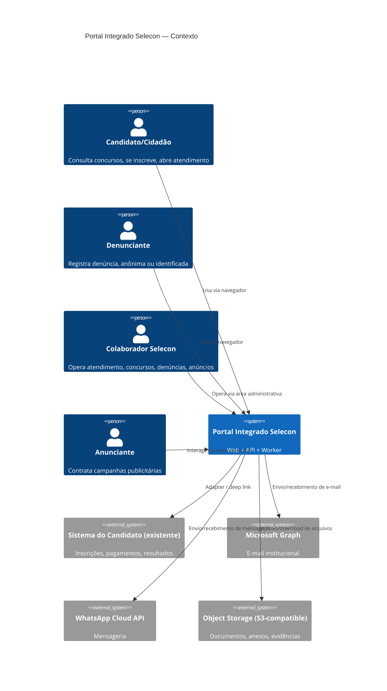
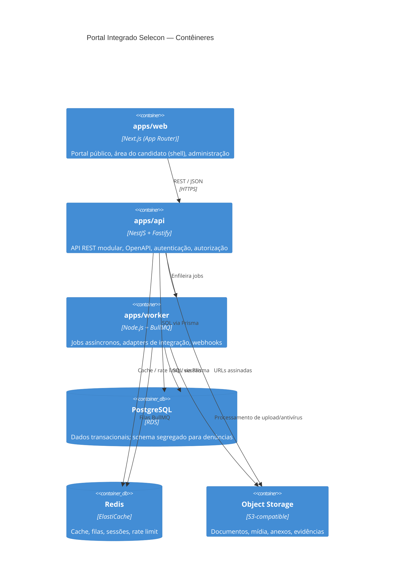
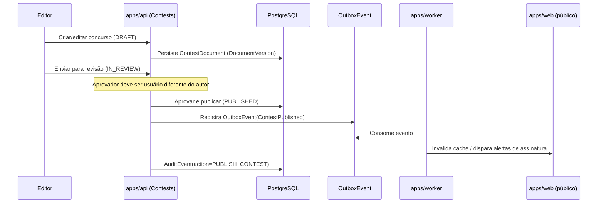

# Arquitetura — Portal Integrado Selecon

## 1. Visão geral (C4 — Contexto)

## 2. Contêineres

## 3. Separação de domínios (módulos lógicos)

Cada módulo tem fronteira de código (`packages/*`, pastas de domínio dentro de `apps/api`) e,
quando aplicável, fronteira de dados:

- **Identity & Access** — usuários internos, papéis, permissões, sessões, MFA.
- **Public Content/CMS** — páginas institucionais, notícias, mídia, menus, redirects, SEO.
- **Contests** — concursos, cronograma, cargos, documentos versionados, comunicados, FAQ.
- **Candidate Gateway** — adapter para o sistema do candidato existente.
- **Customer Service** — tickets, conversas, mensagens, filas, SLA.
- **Knowledge Base** — artigos, revisões, métricas de uso.
- **Notifications** — e-mail/WhatsApp/alertas transacionais.
- **Integrity/Whistleblowing** — **schema, storage e chaves segregados**; nunca compartilha
  tabelas, buckets ou índices de busca com os demais módulos.
- **Advertising** — anunciantes, campanhas, criativos, aprovação, métricas agregadas.
- **Analytics** — métricas first-party, sem dados sensíveis.
- **Audit** — trilha de auditoria imutável pela interface comum.
- **Integrations** — adapters (Graph, WhatsApp, candidato, storage, antivírus).
- **System Administration** — configurações, feature flags, backups.

### Isolamento do módulo de denúncias

O módulo de Integrity/Whistleblowing usa:

- schema de banco de dados dedicado (`whistleblowing`), nunca `JOIN` direto com schemas
  públicos a partir de código de outros módulos;
- prefixo/bucket de storage próprio, com chaves KMS dedicadas;
- nenhuma entidade desse domínio é exposta em buscas globais, dashboards agregados fora do
  próprio módulo, logs de aplicação genéricos ou índices de full-text search compartilhados;
- trilha de acesso (`CASE_ACCESSED`) própria, adicional à auditoria geral.

## 4. Padrões arquiteturais adotados

- Clean Architecture pragmática: `controller` (HTTP) → `application service` → `domain` →
  `repository` (Prisma). Controllers finos, sem regra de negócio.
- Eventos de domínio + outbox transacional para efeitos colaterais críticos (ex.: publicar
  concurso dispara notificação sem acoplar a transação de escrita à chamada externa).
- Idempotência obrigatória em webhooks (Graph, WhatsApp) via chave de deduplicação
  (`event_id`/`message_id`) persistida.
- Circuit breaker + retry com backoff exponencial + dead-letter queue para chamadas a
  serviços externos (implementado no `packages/integrations`, usado por `apps/worker`).
- Feature flags (`SystemSetting`/`FeatureFlag`) para liberação gradual e cutover de migração.
- Health checks: `/health/live`, `/health/ready` (verifica DB, Redis, filas).
- Correlation ID: gerado no edge (Next.js middleware / Fastify hook), propagado via header
  `x-correlation-id` até logs, jobs e eventos de auditoria.
- Paginação cursor-based em listagens grandes (concursos, tickets, auditoria).
- Datas persistidas em UTC; apresentação convertida no client para o fuso configurado
  (`America/Sao_Paulo` por padrão).
- Estados de domínio modelados como enums Prisma (não strings soltas em código de aplicação).

## 5. Diagrama de fluxo — publicação de concurso (exemplo de fronteira autor/aprovador)

## 6. Estado desta versão do documento

Este documento reflete a arquitetura de **fundação (Fase 0)**. Os módulos de domínio ainda
não têm implementação completa de regras de negócio — apenas a estrutura de pastas, schema de
dados inicial e interfaces de adapter. Cada fase subsequente deve atualizar este documento com
os diagramas e decisões específicas do módulo implementado.
