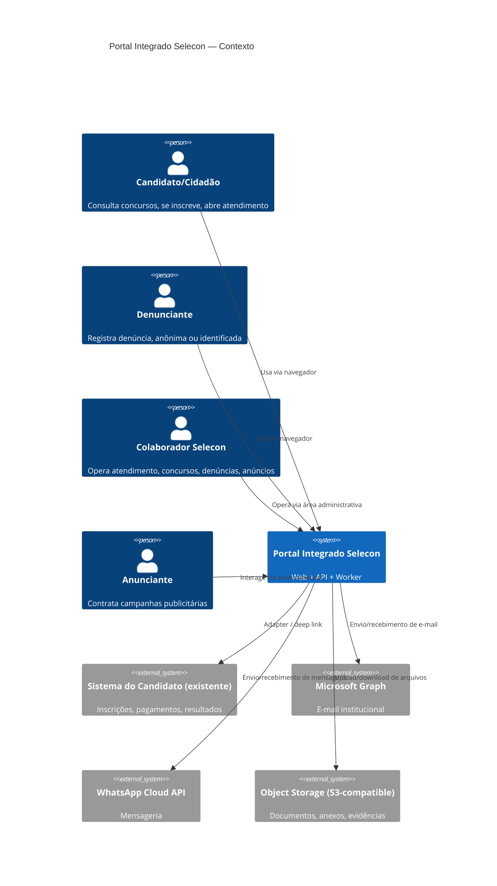
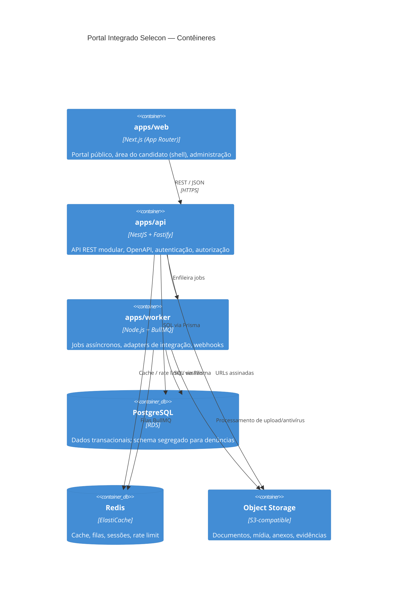
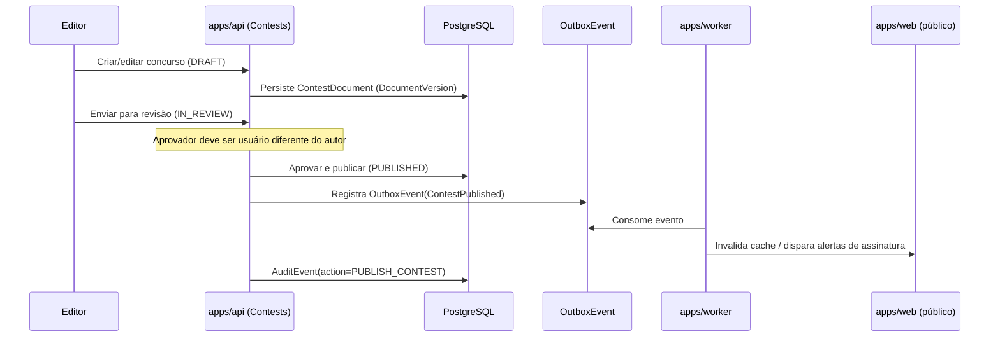
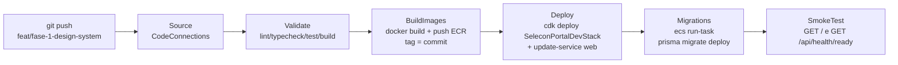

# Arquitetura — Portal Integrado Selecon

## 1. Visão geral (C4 — Contexto)

## 2. Contêineres

## 3. Separação de domínios (módulos lógicos)

Cada módulo tem fronteira de código (`packages/*`, pastas de domínio dentro de `apps/api`) e,
quando aplicável, fronteira de dados:

- **Identity & Access** — usuários internos, papéis, permissões, sessões, MFA.
- **Public Content/CMS** — páginas institucionais, notícias, mídia, menus, redirects, SEO.
- **Contests** — concursos, cronograma, cargos, documentos versionados, comunicados, FAQ.
- **Candidate Gateway** — adapter para o sistema do candidato existente.
- **Customer Service** — tickets, conversas, mensagens, filas, SLA.
- **Knowledge Base** — artigos, revisões, métricas de uso.
- **Notifications** — e-mail/WhatsApp/alertas transacionais.
- **Integrity/Whistleblowing** — **schema, storage e chaves segregados**; nunca compartilha
  tabelas, buckets ou índices de busca com os demais módulos.
- **Advertising** — anunciantes, campanhas, criativos, aprovação, métricas agregadas.
- **Analytics** — métricas first-party, sem dados sensíveis.
- **Audit** — trilha de auditoria imutável pela interface comum.
- **Integrations** — adapters (Graph, WhatsApp, candidato, storage, antivírus).
- **System Administration** — configurações, feature flags, backups.

### Isolamento do módulo de denúncias

O módulo de Integrity/Whistleblowing usa:

- schema de banco de dados dedicado (`whistleblowing`), nunca `JOIN` direto com schemas
  públicos a partir de código de outros módulos;
- prefixo/bucket de storage próprio, com chaves KMS dedicadas;
- nenhuma entidade desse domínio é exposta em buscas globais, dashboards agregados fora do
  próprio módulo, logs de aplicação genéricos ou índices de full-text search compartilhados;
- trilha de acesso (`CASE_ACCESSED`) própria, adicional à auditoria geral.

## 4. Padrões arquiteturais adotados

- Clean Architecture pragmática: `controller` (HTTP) → `application service` → `domain` →
  `repository` (Prisma). Controllers finos, sem regra de negócio.
- Eventos de domínio + outbox transacional para efeitos colaterais críticos (ex.: publicar
  concurso dispara notificação sem acoplar a transação de escrita à chamada externa).
- Idempotência obrigatória em webhooks (Graph, WhatsApp) via chave de deduplicação
  (`event_id`/`message_id`) persistida.
- Circuit breaker + retry com backoff exponencial + dead-letter queue para chamadas a
  serviços externos (implementado no `packages/integrations`, usado por `apps/worker`).
- Feature flags (`SystemSetting`/`FeatureFlag`) para liberação gradual e cutover de migração.
- Health checks: `/health/live`, `/health/ready` (verifica DB, Redis, filas).
- Correlation ID: gerado no edge (Next.js middleware / Fastify hook), propagado via header
  `x-correlation-id` até logs, jobs e eventos de auditoria.
- Paginação cursor-based em listagens grandes (concursos, tickets, auditoria).
- Datas persistidas em UTC; apresentação convertida no client para o fuso configurado
  (`America/Sao_Paulo` por padrão).
- Estados de domínio modelados como enums Prisma (não strings soltas em código de aplicação).

## 5. Diagrama de fluxo — publicação de concurso (exemplo de fronteira autor/aprovador)

## 6. Implantação DEV — CI/CD

Cada estágio é um projeto CodeBuild dedicado (`infrastructure/cdk/lib/pipeline-stack.ts`),
com seu próprio `buildspec-*.yml` na raiz do repositório. Uma falha em qualquer estágio
para o pipeline antes do próximo — nada é implantado se Validate falhar, nenhuma imagem
com problema chega ao ECS se BuildImages falhar, etc.

Pontos de design relevantes:

- **Tags imutáveis por commit.** Cada imagem é publicada com duas tags: a tag imutável do
  commit (`web-dev:<sha12>`) e a tag `:dev` mutável (conveniência para inspeção manual). As
  task definitions de produção sempre apontam para a tag do commit — nunca para `:dev` — via
  o contexto CDK `imageTag`, resolvido em `buildspec-images.yml` a partir de
  `CODEBUILD_RESOLVED_SOURCE_VERSION`.
- **Migrações fora do container da API, e depois do Deploy.** `prisma migrate deploy` roda
  como uma task Fargate avulsa (`aws ecs run-task`) numa família dedicada
  (`selecon-portal-dev-migrate`), nunca dentro do container da api em runtime e nunca
  reaproveitando a família `api` (mesmo a task definition atual da api já apontando para a
  imagem do commit neste ponto, para não poluir o histórico de revisões do serviço real). O
  CodeBuild não tem acesso de rede ao RDS (privado à VPC, sem `vpcConfig` no projeto) — só a
  task Fargate, rodando dentro da VPC com a mesma rede/security groups da api, alcança o
  banco. Migrations roda DEPOIS de Deploy (não antes) — ver o ponto seguinte — e **falha,
  nunca pula**, se a stack ou o serviço da api não existirem/não estiverem `ACTIVE` nesse
  momento.
- **Deploy antes de Migrations — resolve o bootstrap ovo-e-galinha sem "skip gracioso".**
  `SeleconPortalDevStack` (RDS/Redis/S3/api/worker) e `SeleconPortalPipelineStack`
  (CodePipeline/CodeBuild) não têm dependência de props uma na outra — a pipeline pode ser
  criada antes da stack de dados existir. No primeiro run, é o estágio Deploy que cria
  `SeleconPortalDevStack` pela primeira vez; ele já atualiza os três serviços para a imagem
  do commit e espera todos atingirem steady state antes de passar adiante. Isso funciona
  mesmo no primeiro run porque o health check usado para considerar o serviço da api estável
  (`GET /api/health/ready`) só executa `SELECT 1` — não depende de nenhuma tabela migrada
  (`apps/api/src/health/health.service.ts`). Uma versão anterior desta pipeline tinha
  Migrations rodando antes de Deploy e "pulando" (`exit 0`) quando a stack ainda não
  existia — isso deixava uma pipeline "bem-sucedida" no primeiro run sem nunca ter aplicado
  nenhuma migração; corrigido invertendo a ordem (ver `docs/ASSUMPTIONS.md`, item 12).
- **Validação automática de mudanças destrutivas.** `buildspec-deploy.yml` roda `cdk diff`
  antes de `cdk deploy` e falha o build (sem intervenção humana possível numa pipeline
  automatizada) se o diff mencionar remoção de VPC/ALB/cluster ou qualquer sinal de
  substituição (`Replacement`) envolvendo o serviço `web` existente.
- **Nenhuma credencial de banco no CodeBuild.** As migrações usam os mesmos segredos do
  Secrets Manager já injetados na task definition da api — nunca uma variável de ambiente do
  CodeBuild.
- **Rollback.** O `deploymentCircuitBreaker` do ECS reverte automaticamente uma implantação
  que falhe ao estabilizar. Um rollback manual entre revisões de task definition (sem tocar
  em migrações de banco) é feito por `scripts/rollback-ecs-dev.sh`.

Ver `infrastructure/README.md` para a lista completa de comandos e `docs/ASSUMPTIONS.md`
para o histórico de bugs encontrados e corrigidos durante a construção desta pipeline.

## 7. Estado desta versão do documento

Todos os módulos de domínio descritos neste documento (conteúdo/CMS, concursos, atendimento,
denúncias, anúncios, candidato, admin/RBAC) têm implementação completa de regras de negócio,
validada por testes de integração reais (Postgres) e pela suíte E2E — ver `docs/TEST_REPORT.md`.
A infraestrutura AWS (`infrastructure/cdk`) está pronta e `cdk synth`-validada, mas nenhum
recurso foi provisionado nesta sessão (sandbox sem credenciais reais).
