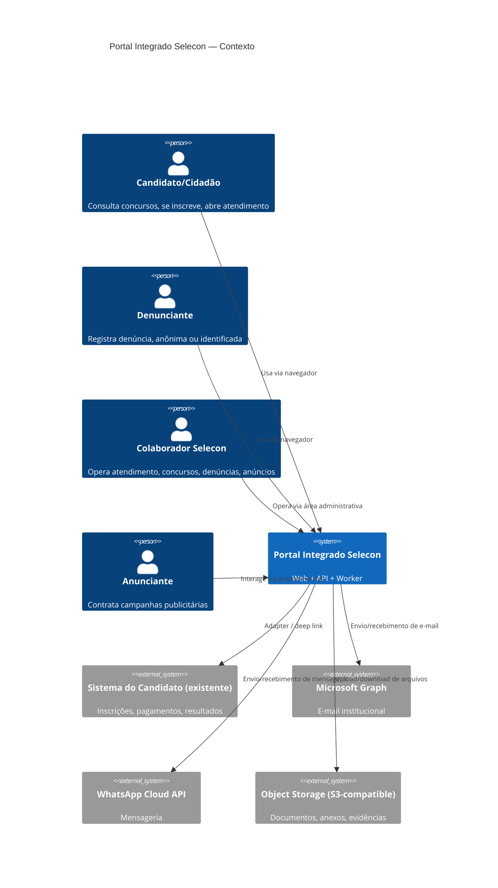
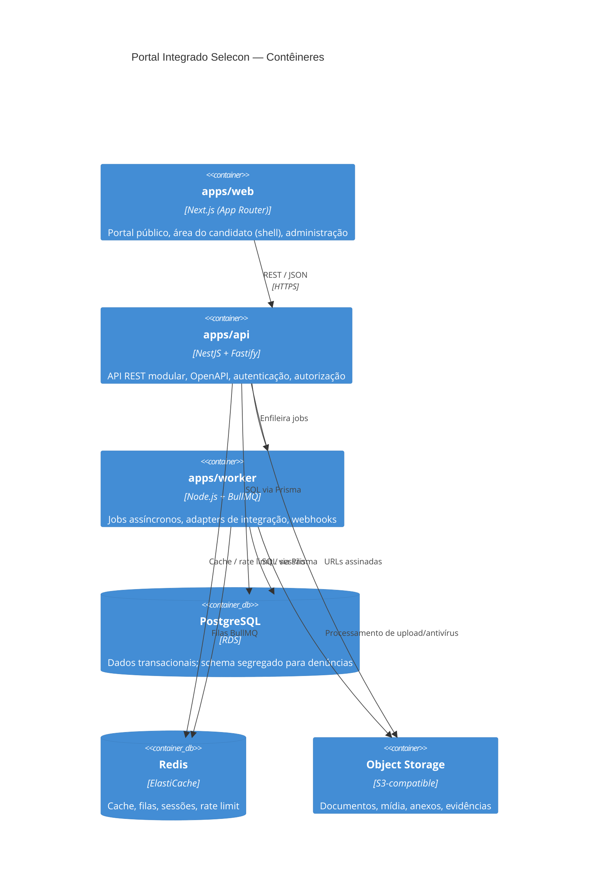
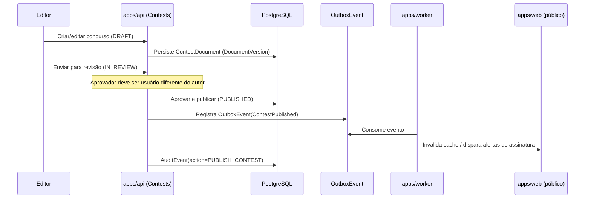
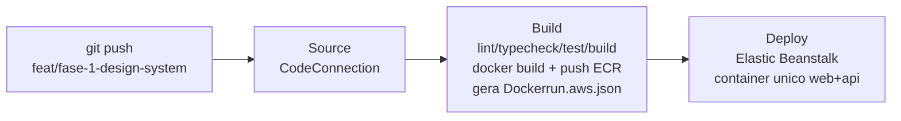

# Arquitetura — Portal Integrado Selecon

## 1. Visão geral (C4 — Contexto)

## 2. Contêineres

## 3. Separação de domínios (módulos lógicos)

Cada módulo tem fronteira de código (`packages/*`, pastas de domínio dentro de `apps/api`) e,
quando aplicável, fronteira de dados:

- **Identity & Access** — usuários internos, papéis, permissões, sessões, MFA.
- **Public Content/CMS** — páginas institucionais, notícias, mídia, menus, redirects, SEO.
- **Contests** — concursos, cronograma, cargos, documentos versionados, comunicados, FAQ.
- **Candidate Gateway** — adapter para o sistema do candidato existente.
- **Customer Service** — tickets, conversas, mensagens, filas, SLA.
- **Knowledge Base** — artigos, revisões, métricas de uso.
- **Notifications** — e-mail/WhatsApp/alertas transacionais.
- **Integrity/Whistleblowing** — **schema, storage e chaves segregados**; nunca compartilha
  tabelas, buckets ou índices de busca com os demais módulos.
- **Advertising** — anunciantes, campanhas, criativos, aprovação, métricas agregadas.
- **Analytics** — métricas first-party, sem dados sensíveis.
- **Audit** — trilha de auditoria imutável pela interface comum.
- **Integrations** — adapters (Graph, WhatsApp, candidato, storage, antivírus).
- **System Administration** — configurações, feature flags, backups.

### Isolamento do módulo de denúncias

O módulo de Integrity/Whistleblowing usa:

- schema de banco de dados dedicado (`whistleblowing`), nunca `JOIN` direto com schemas
  públicos a partir de código de outros módulos;
- prefixo/bucket de storage próprio, com chaves KMS dedicadas;
- nenhuma entidade desse domínio é exposta em buscas globais, dashboards agregados fora do
  próprio módulo, logs de aplicação genéricos ou índices de full-text search compartilhados;
- trilha de acesso (`CASE_ACCESSED`) própria, adicional à auditoria geral.

## 4. Padrões arquiteturais adotados

- Clean Architecture pragmática: `controller` (HTTP) → `application service` → `domain` →
  `repository` (Prisma). Controllers finos, sem regra de negócio.
- Eventos de domínio + outbox transacional para efeitos colaterais críticos (ex.: publicar
  concurso dispara notificação sem acoplar a transação de escrita à chamada externa).
- Idempotência obrigatória em webhooks (Graph, WhatsApp) via chave de deduplicação
  (`event_id`/`message_id`) persistida.
- Circuit breaker + retry com backoff exponencial + dead-letter queue para chamadas a
  serviços externos (implementado no `packages/integrations`, usado por `apps/worker`).
- Feature flags (`SystemSetting`/`FeatureFlag`) para liberação gradual e cutover de migração.
- Health checks: `/health/live`, `/health/ready` (verifica DB, Redis, filas).
- Correlation ID: gerado no edge (Next.js middleware / Fastify hook), propagado via header
  `x-correlation-id` até logs, jobs e eventos de auditoria.
- Paginação cursor-based em listagens grandes (concursos, tickets, auditoria).
- Datas persistidas em UTC; apresentação convertida no client para o fuso configurado
  (`America/Sao_Paulo` por padrão).
- Estados de domínio modelados como enums Prisma (não strings soltas em código de aplicação).

## 5. Diagrama de fluxo — publicação de concurso (exemplo de fronteira autor/aprovador)

## 6. Implantação DEV — CI/CD

> Esta seção descreve a arquitetura ATUAL (Elastic Beanstalk). A arquitetura anterior
> (ECS Fargate + AWS CDK, 6 estágios de pipeline) foi **abandonada** por decisão
> explícita — ver `docs/ASSUMPTIONS.md` para a justificativa e o histórico.

3 estágios apenas: **Source** (CodeStarSourceConnection), **Build** (um único projeto
CodeBuild, `buildspec.yml` na raiz), **Deploy** (ação nativa `ElasticBeanstalk` do
CodePipeline). Definidos em `infrastructure/cloudformation/pipeline.yml` (CloudFormation
puro, sem CDK).

Pontos de design relevantes:

- **Container único (web + api).** `Dockerfile` (raiz) builda `apps/web` (Next.js,
  standalone) e `apps/api` (NestJS) na mesma imagem — ver `docker/entrypoint.sh`, que
  sobe os dois processos lado a lado e propaga sinais de encerramento entre eles.
  `apps/worker` (BullMQ) fica fora deste ambiente DEV.
- **Sem ElastiCache — Redis local efêmero no container.** `apps/api` exige a variável
  `REDIS_URL` (validação de schema em `packages/config`), usada apenas pelo endpoint de
  health check. Em vez de provisionar um ElastiCache só para isso, o container roda um
  `redis-server` local, sem persistência, iniciado pelo próprio `docker/entrypoint.sh`.
- **Migrações no boot do container, não mais via ECS/Fargate.** `prisma migrate deploy`
  roda dentro do container, controlado por `pg_advisory_lock`
  (`apps/api/src/scripts/run-migrations.ts`), ANTES de `apps/api`/`apps/web` começarem a
  atender requisições. Se a migração falhar, o container inteiro falha — o Elastic
  Beanstalk nunca marca uma implantação com schema quebrado como bem-sucedida.
- **Tags imutáveis por commit.** A imagem é publicada no ECR com a tag do commit
  (`CODEBUILD_RESOLVED_SOURCE_VERSION`) e também com `:dev` (conveniência). O
  `Dockerrun.aws.json` gerado pelo `buildspec.yml` sempre aponta para a tag do commit.
- **RDS externo, nunca dentro do container.** PostgreSQL via RDS
  (`infrastructure/cloudformation/rds.yml`), `DATABASE_URL` composta a partir do
  Secrets Manager e definida como propriedade de ambiente do Elastic Beanstalk (nunca
  no Git) por `scripts/bootstrap-elasticbeanstalk-dev.sh`.
- **Rollback.** `scripts/rollback-eb-dev.sh` volta o Environment para a versão anterior
  do Elastic Beanstalk (nunca desfaz migrações de banco automaticamente).

Ver `infrastructure/README.md` para a lista completa de comandos e `docs/ASSUMPTIONS.md`
para o histórico da mudança de arquitetura e os bugs encontrados e corrigidos.

## 7. Estado desta versão do documento

Todos os módulos de domínio descritos neste documento (conteúdo/CMS, concursos, atendimento,
denúncias, anúncios, candidato, admin/RBAC) têm implementação completa de regras de negócio,
validada por testes de integração reais (Postgres) e pela suíte E2E — ver `docs/TEST_REPORT.md`.
A infraestrutura AWS (`infrastructure/cloudformation`) está pronta e validada localmente
(YAML + `cfn-lint`), mas nenhum recurso foi provisionado nesta sessão (sandbox sem
credenciais reais).
